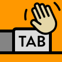

# Make New Tabs Active

  

Bring every new Chrome tab straight into view so you keep your train of thought. Toggle the behavior, snooze it when you need to, and rely on shortcuts to stay in control without hunting for tabs.

## What it does
- Promotes brand-new tabs—including ones opened by other extensions—so they become active instantly.
- Shows status at a glance in the toolbar popup, with a quick toggle and an optional snooze timer.
- Lets you pause the behavior for a custom number of minutes; it resumes automatically.
- Maintains separate states for normal and incognito windows when split-incognito is enabled.
- Provides keyboard shortcuts: `Alt+Shift+T` toggles the extension, `Alt+Shift+S` snoozes for the saved duration.

## Get started
1. Clone or download this repository.
2. Visit `chrome://extensions/`, enable **Developer mode**, and choose **Load unpacked**.
3. Select the repository folder and pin the toolbar icon if you want easy access to the popup.

## Daily use
- Click the toolbar button to see whether the extension is **Enabled**, **Disabled**, or **Snoozed**.
- Hit **Toggle** for an immediate on/off switch, or **Snooze** to pause it for the minutes shown in the input.
- Change the snooze duration by entering a new value; it saves on blur or when you press Enter.
- Shortcuts mirror the popup actions and can be customized through Chrome's keyboard shortcut settings.

## Technical reference

### Build a signed package (optional)
- Run the macOS helper script `./make.sh` to create a `.crx` via Chrome's `--pack-extension` flag.
- Before running, set `CHROME_BINARY` and `CHROME_KEY` in the script so they match your local Chrome installation and private key.
- The built archive is saved as `make-new-tabs-active-<version>.crx` in the project root.

### Localization
- User-facing copy comes from Chrome's i18n system in `_locales/`.
- Create a new locale by copying `en/messages.json`, then update each `message` value with the translated text.
- `popup.html` is auto-localized at runtime, so you don't need markup changes when adding locales.

### Development notes
- Tab activation logic lives in `background.js`; the popup experience is handled by `popup.html`, `popup.css`, and `popup.js`.
- There are no automated tests, so verify changes manually by loading the unpacked extension and trying the toggle and snooze flows.
- Keep localization keys in `manifest.json` synchronized with the entries in `_locales` when adding or renaming strings.
